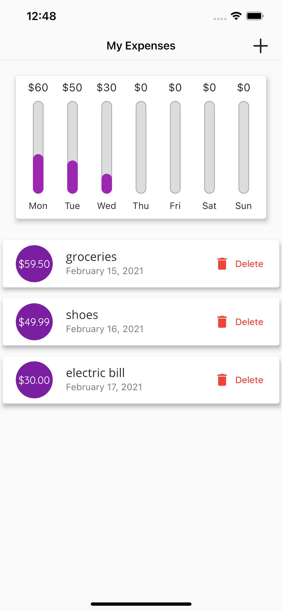
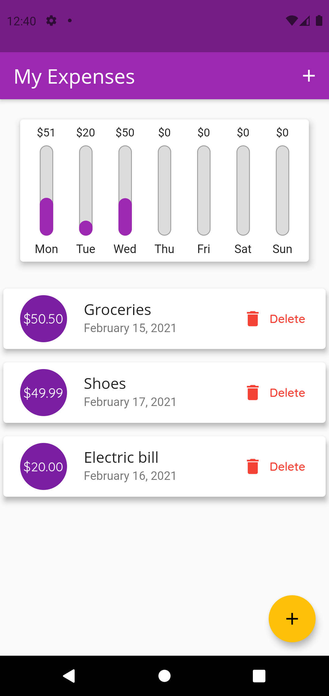

# My-Expenses
A personal expenses app that allows you to track and keep on top of your personal expenses

## What does it do?

This application keeps track of all your expenses of the current week and displays your daily expenditure as a percentage of your total spendings of the week.

To track an expense:

    1. Click on the `+` icon
    2. Enter the name of the expense and amount.
    3. Select the day this expense was paid.

## Screenshots

